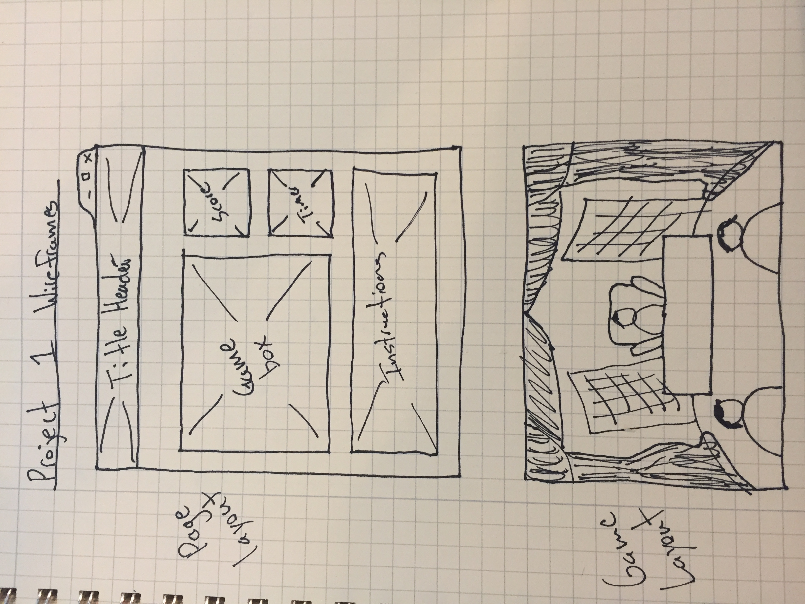

# whack-a-trump

# [Link to my Trello](https://trello.com/b/ScO9V4qE/project-1-wdi3)

#[Link to my GH Pages version of site](https://alexi-o.github.io/whack-a-trump/)

Tools Used: 
	-Javascript, HTML, CSS

Gameplay: 

The object of this two-player game is to acheive the higher score by "whacking" the most Trumps in a 20 second time period. At the end of each round, the player's score will be displayed within the center of the screen. At the end of Player 2's turn, the scores will be compared and a winner message will be displayed.

Approach:

The main function running the game utilizes a random number generator and has three value ranges which produce a Trump from one of three locations. The three Trumps are stored in divs which are initially set to hidden. Once called upon through the random number generator function, their visibility is set to 'visible' for a duration of 3 seconds. If clicked, they are set to visible and a point is logged for the current player. At the end, the two scores are compared to determine a winner.

Unsolved Problems:

There seem to be some issues with the random number generator that creates the Trumps. At moments when the same Trump is triggered twice in a row, it almost immediately removes them and seems laggy.